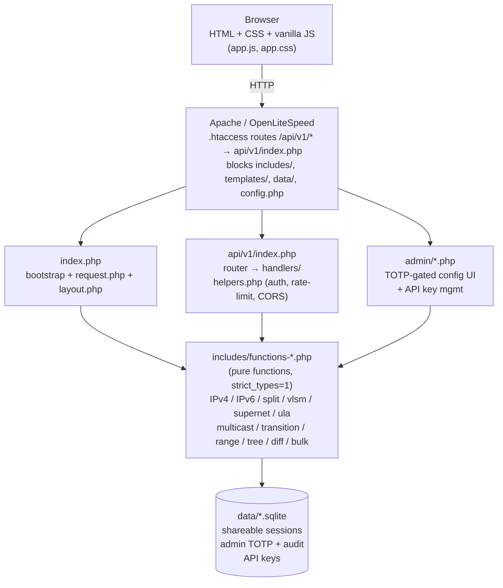

# Subnet Calculator — Master Design Document

**Status:** Living document. Update at the end of any release or major change.
**Current version:** v3.7.1
**Last updated:** 2026-05-21
**Authoritative for:** Architecture, design decisions, code methodology, invariants, and the "why" behind every load-bearing choice.

This document is the single source of truth for understanding the app's structure and intent. The `README.md` is for users; `CLAUDE.md` is the agent quick-reference; `CHANGELOG.md` is the per-release log. **This file explains why the code looks the way it does.**

---

## 1. Product purpose

A zero-install, self-hostable IPv4 + IPv6 subnet calculator with deep tooling for network engineers: split, summarise, plan, decode transition mechanisms, lay out multicast groups, generate ULAs, plan VLSM, diff allocations, share results via URL, and consume any of it via a documented REST API. Runs as a single PHP app behind a generic webserver. No SaaS dependency, no telemetry, no required database (SQLite is used only for the optional shareable-session store).

**Design north star:** a single page that does everything inline. No SPA, no build step for end users, no JS framework. The app must work with JS disabled for everything except clipboard/iframe niceties.

---

## 2. High-level architecture



### 2.1 Request flow (web UI)

1. `index.php` sends security headers (CSP with nonce, HSTS, X-Content-Type-Options, Permissions-Policy), requires `config.php` then every `functions-*.php`, then `request.php`.
2. `request.php` reads `$_GET`/`$_POST`, runs form protection (honeypot/Turnstile), dispatches to `sc_run_*()` helpers that populate template globals (`$result`, `$result6`, `$split_result`, `$vlsm_plan`, etc.).
3. `templates/layout.php` renders the chrome (head, header, tab strip, footer) and includes per-tool partials from `templates/_tools/<slug>.php` which render trigger buttons + drawer panels and read the template globals.
4. Browser hydrates: theme init runs in `<head>` before paint to avoid FOUC; `app.js` wires drawer open/close, copy buttons, iframe resize reporter, and tool-group localStorage persistence.

### 2.2 Request flow (REST API)

1. `.htaccess` rewrites `/api/v1/<path>` → `api/v1/index.php`.
2. `api/v1/index.php` requires `helpers.php` (CORS, rate-limit, auth, `json_ok`/`json_err`) and `../../includes/*.php`.
3. Dispatches by path to `handlers/<name>.php`. Each handler validates input, calls the same pure functions the web UI uses, and emits JSON via `json_ok()`.
4. OpenAPI 3.1 spec lives at `api/openapi.yaml`; lint gate enforces it on every PR.

**Key invariant:** the web UI and the REST API call the **same pure functions**. The only divergence is input shape (form-encoded vs JSON) and output rendering (HTML partial vs JSON envelope). New tools register both surfaces in lockstep.

---

## 3. Repository layout

```
Subnet-Calculator/              ← docroot (point webserver here)
  index.php                     ← bootstrap (~30 lines)
  config.php.example            ← copy → config.php for overrides
  sw.js                         ← service worker (offline shell + CACHE_NAME)
  .htaccess                     ← routing + asset cache + secret blocks
  robots.txt
  includes/                     ← pure functions; web-blocked
    config.php                  ← defaults + optional config.php require
    request.php                 ← form/GET dispatch
    functions-resolve.php       ← hostname → IP resolution (web+API shared)
    functions-ipv4.php          ← IPv4 arithmetic
    functions-ipv6.php          ← IPv6 arithmetic (GMP)
    functions-vlsm.php          ← IPv4 VLSM allocator
    functions-vlsm6.php         ← IPv6 VLSM allocator (GMP)
    functions-split.php         ← subnet splitter
    functions-supernet.php      ← IPv4 supernet/summarise
    functions-supernet6.php     ← IPv6 supernet/summarise
    functions-ula.php           ← RFC 4193 ULA generator
    functions-range.php         ← IP-range → CIDR list (IPv4)
    functions-range6.php        ← IP-range → CIDR list (IPv6)
    functions-tree.php          ← allocation tree + gap detection
    functions-tree-presets.php  ← named tree templates
    functions-tree-diff.php     ← tree-level diff for tree editor
    functions-diff.php          ← CIDR-list diff with canonical-form normalisation
    functions-lookup.php        ← inverse subnet lookup (IP+mask → CIDR)
    functions-bulk.php          ← batch endpoint dispatcher
    functions-rdns6.php         ← IPv6 reverse-DNS zone generator
    functions-type6.php         ← IPv6 address-type classification
    functions-zone6.php         ← IPv6 zone-ID parsing (fe80::1%eth0)
    functions-mapped6.php       ← IPv4-mapped IPv6 (::ffff:a.b.c.d)
    functions-nat64.php         ← RFC 6052/6146 NAT64 PLAT/CLAT
    functions-6to4.php          ← RFC 3056
    functions-teredo.php        ← RFC 4380
    functions-isatap.php        ← RFC 5214
    functions-6rd.php           ← RFC 5969
    functions-embedded-v4.php   ← detect embedded-IPv4 in IPv6
    functions-embedded-rp6.php  ← RFC 3956 embedded-RP multicast
    functions-multicast6.php    ← RFC 4291/3306 multicast decoder
    functions-ssm6.php          ← unicast-prefix-based multicast
    functions-pmtu6.php         ← IPv6 PMTU/fragment helper
    functions-prefix-plan6.php  ← /48 → /56 → /64 nibble planner
    functions-nibble6.php       ← nibble-boundary arithmetic
    functions-rfc3531.php       ← RFC 3531 reversible address-block allocation
    functions-slaac6.php        ← SLAAC EUI-64 / RFC 7217 / RFC 4941 privacy
    functions-derive6.php       ← derive IPv6 from MAC / interface ID
    functions-session.php       ← shareable-session CRUD (SQLite)
    functions-apikeys.php       ← API key issuance + auth
    functions-audit.php         ← admin audit log
    functions-admin-auth.php    ← admin login (TOTP)
    functions-admin-session.php ← admin cookie sessions (SQLite)
    functions-admin-totp.php    ← TOTP helpers (RFC 6238)
    functions-admin-settings.php← persisted operator settings
    functions-admin-wizard.php  ← first-run setup
    functions-util.php          ← help_bubble(), badge helpers
  templates/                    ← HTML; web-blocked
    layout.php                  ← page chrome + tab panels (~950 lines after T2)
    _tools/<slug>.php           ← 35 per-drawer partials (one per tool)
    _tree_editor.php            ← tree editor partial
  api/
    openapi.yaml                ← OpenAPI 3.1 spec
    v1/
      index.php                 ← router
      helpers.php               ← auth, rate-limit, CORS, json envelope (blocked)
      .htaccess                 ← front-controller rewrite
      handlers/<name>.php       ← one per endpoint
  admin/                        ← operator console (TOTP-gated)
    index.php, login.php, logout.php, totp.php, totp-verify.php,
    settings.php, keys.php, audit.php, _wizard.php, _sidebar.php
  assets/                       ← public, long-cached
    app.css, app.js, logo.{webp,png}, favicon-32.{webp,png},
    vendor/xlsx/xlsx.full.min.js (SRI-verified, defer-loaded)
  data/                         ← SQLite DB; web-blocked; git-ignored

docs/                           ← MkDocs Material (user-facing, GH Pages)
docs/internal/                  ← internal specs + this design doc
docs/superpowers/               ← per-release plans + living docs
testing/
  unit/                         ← PHPUnit 11 (785 tests / 1771 assertions @ v3.7.0)
  scripts/playwright_test.py    ← ~2763 Playwright assertions
  snapshots/                    ← Pillow visual regression baselines
  fixtures/                     ← test fixtures incl. iframe-test.html
releases/                       ← versioned tarballs
.github/workflows/              ← CI: php.yml (3-version matrix), docs.yml
.semgrep/rules.yml              ← custom Semgrep rules
.claude/                        ← agent skills + hooks
```

---

## 4. Code methodology

### 4.1 Pure-function core

Every `includes/functions-*.php` file:

- Starts with `declare(strict_types=1);`
- Exports pure functions (no globals, no I/O except inside the dedicated `functions-session.php` / admin files).
- Takes typed scalars or arrays; returns typed scalars or associative arrays.
- Throws `InvalidArgumentException` for caller-provided bad input. Never returns `false`/`null` to signal "invalid" — the type system carries the contract.

**Why:** the same function powers the web form, the API handler, the unit test, and the Playwright assertion. If a function had side effects or globals, those four call sites would drift.

### 4.2 IPv4 arithmetic discipline

PHP's `ip2long()` returns a **signed** integer on 64-bit systems. After every bitwise op, mask with `& 0xFFFFFFFF`. This is the #1 historical bug source in this codebase. Any new IPv4 math must follow the same convention; the existing helpers (`cidr_to_mask`, `network_address`, etc.) already do.

### 4.3 IPv6 arithmetic discipline

**Always GMP.** Never PHP signed-int math. The standard pipeline is:

```
inet_pton($addr) → bin2hex() → gmp_init($hex, 16) → gmp_*() ops →
gmp_strval($gmp, 16) → str_pad(…, 32, '0', STR_PAD_LEFT) → hex2bin() → inet_ntop()
```

Subnet counts ≥ 2^63 are represented as the **string** `"2^N"` — never a PHP int. The VLSM6 allocator and `calculate_subnet6()` both honour this convention; new IPv6 code must too.

### 4.4 Strict typing + PHPStan L9

The whole tree (excluding admin templates) passes PHPStan **level 9** with `--memory-limit=512M`. Level 9 forbids `mixed` returns and enforces array shapes. Don't downgrade to silence errors; fix the type.

### 4.5 Input validation surface

All caller-controlled input is validated **at the boundary** (`request.php` for web, the handler file for API). Pure functions trust their inputs because the boundary already validated them. This is enforced by:

1. Boundary validators throw `InvalidArgumentException`.
2. Web boundary catches → renders error banner.
3. API boundary catches → emits `json_err(400, ...)`.
4. Pure functions assume preconditions hold.

### 4.6 No silent fallbacks

If a feature can't run (missing GMP, missing SQLite, Turnstile keys absent), surface it explicitly. Never silently degrade — the v3.6.2 `cidrs_overlap` bug shipped for 5+ months because broken code coincidentally produced correct output for the test fixtures. Surface failures loudly.

### 4.7 Shareable URL symmetry (`sc_run_*` helpers)

Every tool that supports shareable URLs uses a single helper in `request.php` (`sc_run_lookup`, `sc_run_diff`, `sc_run_split`, etc.) that handles **both** POST submission and GET hydration. The template renders identically for either method. Never split POST and GET into separate code paths — they will drift.

### 4.8 No new design tokens without explicit approval

CSS custom properties (`--color-*`, spacing scale, type scale) are frozen except by formal style-guide updates (v2.9.0 baseline). New components reuse existing tokens.

### 4.9 Comments policy

Default to none. Comments are only for non-obvious WHY: hidden constraints, subtle invariants, workarounds for specific bugs, behaviour that would surprise a reader. Never restate WHAT the code does. Never reference issue numbers in comments — those rot.

---

## 5. Key invariants (load-bearing — break these and things explode)

| # | Invariant | Lives at | Why |
|---|---|---|---|
| I1 | IPv4 bitwise results masked with `& 0xFFFFFFFF` | every `functions-ipv4.php` op | `ip2long` is signed on 64-bit |
| I2 | IPv6 arithmetic uses GMP exclusively | every `functions-*6.php` | 128-bit overflows PHP signed int |
| I3 | IPv6 subnet/host counts ≥ 2^63 are string `"2^N"` | `calculate_subnet6`, `vlsm6_allocate` | int overflow |
| I4 | `--color-bg` CSS custom property must keep that exact name | `app.css`, `app.js` iframe API | iframe consumers call `style.setProperty('--color-bg', …)` |
| I5 | `--color-btn-text` stays dark for teal buttons | `app.css` both themes | WCAG AA contrast with teal background |
| I6 | `.card` uses `overflow-x: clip` base, full `clip` only ≤480px | `app.css` | preserves vertically-escaping tooltips on desktop |
| I7 | CSP nonce on every inline `<style>`/`<script>` | `index.php` headers + `layout.php` | strict CSP forbids unnonced inline |
| I8 | Anchored rsync excludes for production deploy | `/release` skill | unanchored `config.php` matches bundled defaults too (v3.5.0 lesson) |
| I9 | `sleep 3` after `systemctl restart lsws` | deploy runbooks | OPcache settle time (v3.6.3 lesson) |
| I10 | Bump `CACHE_NAME` in `sw.js` every release | release checklist | service worker activate handler only purges on constant change (v3.2.2 lesson) |
| I11 | `admin/_test-drain.php` excluded from release tarballs | tarball build command | test-rig only (#324) |
| I12 | `htmlspecialchars()` always uses `ENT_QUOTES` | every template echo | single-quoted attribute safety |
| I13 | Page landmark is `<main id="main-content">` on the outermost card | `layout.php` | skip link + iframe consumers target this |
| I14 | Help bubbles use `tabindex="0" role="button" aria-label="Help"` | `help_bubble()` in `functions-util.php` | keyboard focus reveals tooltip via existing `:focus-within` CSS |
| I15 | `subnet_diff()` normalises CIDRs to canonical form before comparing | `functions-diff.php` | `10.0.0.5/24` and `10.0.0.0/24` are the same network |
| I16 | Web UI + REST API call the same pure functions | enforced by handler imports | one source of truth for behaviour |
| I17 | Boundary validates; pure functions trust | `request.php` + `api/v1/handlers/*.php` | avoids double-validation drift |
| I18 | `cidrs_overlap` uses `min($px_a, $px_b)` for shared-prefix test | `functions-ipv4.php` / `-ipv6.php` | broader mask is the correct comparator (v3.6.2 P1 fix) |
| I19 | PMTU `payload_size ≤ 65535`, `fragment_count ≤ 4096` | `functions-pmtu6.php` | DoS prevention (v3.6.3) |
| I20 | Session IDs are 16 hex chars (not 8) | `functions-session.php` | entropy widening (v3.6.4) |
| I21 | `:focus-visible` (not `:focus`) for focus rings | `app.css` | no sticky mouse-click outline (v3.7.0 T5) |
| I22 | Each `_tools/<slug>.php` partial reads via existing template globals | `templates/_tools/*.php` | no new data flow introduced by T2 refactor |

When in doubt, search this table before changing the affected file.

---

## 6. Design decisions and their rationale

### 6.1 Why a PHP monolith and not a framework

Operator audience: small/medium network teams who already run LAMP. Drop-in tarball install on any shared host. No composer dependency at runtime (composer is dev-only — PHPUnit/PHPStan/PHPCS). No build step. The whole app is `unzip; chmod; done`.

### 6.2 Why no JS framework

Same audience reason, plus: the calculator output is deterministic from request input — there's nothing to "react" to. A 2845-line `app.js` handles drawers, theme, copy, iframe resize, and tool-group persistence. That's plenty.

### 6.3 Why single-page tabs and not multi-page

Sharing. A single URL with query params shares any tool's exact state across teams. Multi-page would fragment the shareable surface. The IPv6 wall-of-buttons UX cost (v3.7.0 T3 mitigated via collapsible groups) was the tradeoff.

### 6.4 Why tool drawers instead of separate pages

Same: keeps every tool one click from the calculator, sharing the IPv4/IPv6/VLSM result above. The `data-tool="<slug>"` markup convention is the contract; T2 (v3.7.0) extracted these into `_tools/<slug>.php` partials so future tools touch one file plus a one-line include.

### 6.5 Why SQLite for sessions, API keys, admin auth

Zero external dependencies. File-based; backup is `cp data/*.sqlite`. No SQL injection risk because there's no user-controllable SQL surface — all queries are parameterised and table contents are write-only by trusted code paths (admin TOTP-gated, sessions are server-generated IDs).

### 6.6 Why GMP and not BCMath

GMP is faster, supports bitwise ops natively (BCMath does not), and is a standard PHP extension on every modern distro. The session-start hook installs `php-gmp` automatically on the dev server.

### 6.7 Why we ship a service worker

Pure cache-first offline shell. Zero network code (no Background Sync, no Push). Bumping `CACHE_NAME` per release is the only maintenance cost. The v3.2.2 release shipped specifically to recover from missed bumps accumulating from v2.7.0 → v3.2.1 — never skip this.

### 6.8 Why CSP with per-request nonce

Strict CSP without `unsafe-inline`. Theme-init inline script and conditional `bg_override_style` inline styles use the per-request nonce. CSP also blocks the most common XSS payload patterns even if a future `htmlspecialchars()` slip got past CodeQL/Semgrep.

### 6.9 Why we don't trust CI solely (v3.6.2 lesson)

CI gates (PHPUnit, PHPStan, PHPCS, Spectral, Semgrep, Playwright) are necessary but **not sufficient**. The `cidrs_overlap` bug shipped for 5+ months because all tests used `10.0.0.0/X` pairs where both networks coincidentally produced correct results despite broken `max()` masking. Manual production regression on every release with Playwright + `ui-ux-pro-max` is mandatory now.

### 6.10 Why anchored rsync excludes (v3.5.0 lesson)

Unanchored `--exclude='config.php'` matches **both** the operator's local `config.php` (correct — preserve) and the bundled `includes/config.php` (wrong — would be skipped, breaking the install). Always anchor: `--exclude='/config.php' --exclude='/data/'`.

### 6.11 Why `sleep 3` after `systemctl restart lsws` (v3.6.3 lesson)

OPcache takes ~1–2 seconds to settle after lsws restart. The first PMTU smoke test after v3.6.3 deploy returned the pre-fix 39.6MB response because OPcache served stale bytecode briefly. Three-second sleep eliminates the race entirely.

### 6.12 Why per-tool URL routes (`?tool=<slug>`)

Locked from v3.4.0 T7. Deep-linking into a specific drawer means support docs can include a one-click link to "the wildcard tool" or "the PMTU calculator." Each new drawer registers in the lookup map. URL state survives reloads and is included in shareable URLs.

### 6.13 Why `help_bubble()` instead of `title` attributes

`title` is mouse-only and unstyled. `help_bubble()` emits an icon with `tabindex="0" role="button" aria-label="Help"` and the existing `:focus-within` CSS reveals a styled tooltip on keyboard focus without any JS. Inherits a11y from v2.5.0.

### 6.14 Why we keep PHP 8.1 runtime support but require 8.2+ in CI

Dev tools (PHPUnit 11, PHPStan 2) need 8.2+. App runtime code uses only 8.1-compatible syntax. Shared hosts on 8.1 can still install; PRs are validated against 8.2/8.3/8.4. Drop 8.1 runtime support when we adopt readonly classes or other 8.2+ syntax.

### 6.15 Why CodeRabbit reviews even though we run multiple linters

CodeRabbit catches conventions and naming consistency that ASTs don't model. Treat its nitpicks as "consider"; treat its actionable findings as "fix before merge unless explicitly deferred."

### 6.16 Why the Memory MCP graph is project-scoped

Each release entity (`project:subnet-calculator:release:vX.Y.Z`) accumulates observations during work: SHA, files touched, test results, gate outcomes. Cross-release relations (`predecessor-of`, `is-regression-of`) preserve the chain of "what changed and why." Re-derivable from git, but the graph is the fast working layer.

---

## 7. Feature catalogue (by tab)

### 7.1 IPv4 tab

Calculator + 5 drawer tools:
- **Split** — divide a parent CIDR into N equal subnets (count or new prefix).
- **VLSM** — variable-length allocator from a host-count list; exports CSV/JSON/XLSX.
- **Supernet / summarise** — find common supernet for a CIDR list.
- **Range → CIDR** — inverse: minimum CIDR list covering an arbitrary range.
- **Overlap / multi-CIDR check** — pairwise or N-way overlap detection.
- **Wildcard ↔ CIDR** — ACL helper. Accepts string or int (v2.10.0 widening).
- **Lookup** — IP + arbitrary mask → CIDR.
- **Diff** — before/after CIDR list with added/removed/changed/unchanged categories; canonical-form normalisation (v2.11.0).
- **Tree** — hierarchical allocation tree with gap detection; named presets; tree-level diff in the editor.

### 7.2 IPv6 tab

Calculator + **19 drawer tools** organised into 5 collapsible groups (v3.7.0 T3):
- **Foundational** (4): split6, ula (RFC 4193), range6, supernet6.
- **Address utilities** (4): zone-id, derive (MAC/IFID → IPv6), slaac (EUI-64 + RFC 7217 + RFC 4941), rdns6.
- **Transition** (6): mapped6/nat64 (RFC 6052/6146), embedded-v4 detect, 6to4 (RFC 3056), teredo (RFC 4380), isatap (RFC 5214), 6rd (RFC 5969).
- **Prefix planning** (3): prefix-plan6 (/48→/56→/64), nibble6, rfc3531.
- **Multicast** (4): multicast6 scope decoder (RFC 4291/3306), ssm6 (unicast-prefix-based), embedded-rp6 (RFC 3956), pmtu6.

### 7.3 VLSM tab

IPv4 VLSM planner; shareable URL; CSV/JSON/XLSX export; utilisation summary; session TTL notice.

### 7.4 VLSM IPv6 tab

GMP-based IPv6 VLSM (v2.11.0). Host counts may be int or `"2^N"` string. No broadcast/network reservation (RFC 4291 unicast).

### 7.5 Admin console

TOTP-gated. Manage operator settings, API keys (issuance + revocation + per-key rate limits), audit log, first-run wizard.

---

## 8. REST API surface

OpenAPI 3.1 at `api/openapi.yaml`. Spectral-linted on every PR.

| Endpoint | Method | Purpose |
|---|---|---|
| `/api/v1/meta` | GET | Version, capabilities |
| `/api/v1/changelog` | GET | Parsed CHANGELOG.md |
| `/api/v1/openapi` | GET | Spec itself |
| `/api/v1/schemas` | GET | JSON Schemas |
| `/api/v1/ipv4`, `/ipv6` | POST | Calculator |
| `/api/v1/split`, `/split6` | POST | Splitter |
| `/api/v1/vlsm`, `/vlsm6` | POST | VLSM |
| `/api/v1/supernet`, `/supernet6` | POST | Summarisation |
| `/api/v1/ula` | POST | RFC 4193 generation |
| `/api/v1/range`, `/range6` | POST | Range → CIDR |
| `/api/v1/overlap` | POST | N-way overlap |
| `/api/v1/wildcard` | POST | Wildcard ↔ CIDR |
| `/api/v1/lookup` | POST | Inverse lookup |
| `/api/v1/diff` | POST | CIDR-list diff |
| `/api/v1/rdns`, `/rdns6` | POST | Reverse zone |
| `/api/v1/tree` | POST | Allocation tree |
| `/api/v1/tree-presets` | GET | Named templates |
| `/api/v1/zone-id` | POST | IPv6 zone-ID |
| `/api/v1/derive` | POST | MAC/IFID → IPv6 |
| `/api/v1/slaac-privacy` | POST | SLAAC variants |
| `/api/v1/mapped6`, `/nat64`, `/6to4`, `/teredo`, `/isatap`, `/6rd`, `/embedded-v4` | POST | Transition decoders |
| `/api/v1/multicast6`, `/ssm6`, `/embedded-rp6`, `/pmtu6` | POST | Multicast + PMTU |
| `/api/v1/prefix-plan6`, `/nibble6`, `/rfc3531` | POST | Prefix planning |
| `/api/v1/bulk` | POST | Batch multiple ops in one request |
| `/api/v1/sessions` | GET/POST | Shareable session store |
| `/api/v1/admin/keys` | various | API key admin (auth-gated) |

**Auth modes:** anonymous (rate-limited), API key (`Authorization: Bearer <key>`; per-key rate limit), admin (cookie session, TOTP).

**Envelope:** `{ok: true, data: …}` or `{ok: false, error: {code, message}}` via `json_ok()`/`json_err()` in `helpers.php`.

---

## 9. Testing topology

| Layer | Tool | Where | Scale @ v3.7.0 |
|---|---|---|---|
| Unit | PHPUnit 11 | `testing/unit/` | 785 tests / 1771 assertions |
| E2E browser | Playwright (Docker) | `testing/scripts/playwright_test.py` | ~135 test groups / 2763 assertions |
| Visual regression | Pillow snapshots | `testing/snapshots/` | committed PNGs, diffed on snapshot runs |
| Static analysis | PHPStan L9 | `phpstan.neon` | enforced in CI |
| Lint | PHPCS PSR-12 | `.phpcs.xml`, `.phpcs-admin.xml` | CI gate |
| Security | Semgrep | `.semgrep/rules.yml` + OWASP top-ten + sql-injection | CI gate + pre-tool hook |
| OpenAPI | Spectral | `api/openapi.yaml` | CI gate |
| JS/CSS | ESLint + Stylelint | `package.json` | CI gate |
| **Manual** | **Production regression** | **`ui-ux-pro-max` + Playwright** | **Mandatory every release** |

The manual production regression gate is non-negotiable after the v3.6.2 lesson (see §6.9).

---

## 10. Release engineering

### 10.1 Branching model

**Single source of truth for branching.** `coding-guide.md` and `CLAUDE.md` point here.

#### Long-lived branches

- **`main`** — the release branch. Tags live here. Every commit on `main` is shipped to production. PRs only land via merge (no direct pushes). Always green.
- **`dev`** — historically the active-development integration branch. In current practice (v3.x), feature work tends to branch directly off `main` or off the active `release/vX.Y.Z`. `dev` is preserved but not load-bearing; do not block on it.

#### Per-release branches

- **`release/vX.Y.Z`** — integration branch for an in-flight release. Cut from `main` at release kickoff (T1). All feature/task branches for that release PR **into** this branch. When the release is ready, a single PR `release/vX.Y.Z → main` ships it. Tag `vX.Y.Z` after the merge.

#### Short-lived branches

| Prefix | Branched from | Merges into | Used for |
|---|---|---|---|
| `feature/v<X.Y.Z>-<slug>` | active `release/vX.Y.Z` (or `main` if no release is open) | the release branch it was cut from | Per-task work inside a release (e.g. `feature/v3.7.0-a11y-polish`) |
| `fix/<slug>` | the tag of the broken release (e.g. `v3.6.0`) | new `release/vX.Y.Z+1` branch | Patch fixes — see "Patch releases" below |
| `chore/<slug>` | `main` | `main` directly via PR | Dependabot bumps, CI tweaks, doc-only changes that don't need a release |
| `hotfix/<slug>` | `main` | `main` directly via PR, then cherry-pick to active `release/*` if open | Urgent production fix that cannot wait — see "Hotfixes" below |

Branch names use lowercase, hyphens, no spaces.

#### Patch releases (vX.Y.Z+1)

When a bug ships to production and needs to go out independently of the next minor:

1. Branch `release/vX.Y.Z+1` from the **`vX.Y.Z` tag** (not from `main`, which may have un-shipped work).
2. Cherry-pick or write the fix on a `fix/<slug>` branch off the new release branch.
3. PR `fix/<slug> → release/vX.Y.Z+1`.
4. Run the release checklist (§10.2) including the manual regression gate.
5. PR `release/vX.Y.Z+1 → main`, merge, tag.
6. If a higher in-flight release branch exists (e.g., `release/v3.8.0`), the fix is forward-ported to it via a separate cherry-pick PR. Don't let the in-flight minor regress on a fix the patch shipped.

#### Hotfixes

For genuine production emergencies (security, availability) that cannot wait for the next scheduled release:

1. Branch `hotfix/<slug>` from `main`.
2. Fix, test, PR to `main`. Merge with operator approval; CodeRabbit may be `--admin`-bypassed if review is blocking and the fix is small and obvious.
3. Tag the resulting commit as `vX.Y.Z+1` (still a patch release — increment patch).
4. Deploy via the normal release runbook (anchored rsync, `sleep 3`, Cloudflare purge, smoke).
5. Cherry-pick to any open `release/*` branches.

Hotfixes are rare. The default is "ship a patch release through the normal flow." Hotfix is for "production is on fire right now."

#### Merge style

- **Always `--merge` (true merge commit) for `release/* → main`.** The repo policy disallows squash; the merge commit is the readable record that "release vX.Y.Z landed here."
- **`--merge` is also the default for feature branches into a release branch.** Preserves task-level history.
- **`--admin` only when CodeRabbit posted stale CHANGES_REQUESTED** on early task commits and the operator has approved the merge. Document the override in the PR description.
- **Never `--squash`** — the repo will reject it.
- **Never force-push to `main` or `release/*`.** Force-push is fine on `feature/*` and `fix/*` before they're merged (rebase to keep history tidy).

#### Cleanup

- **After a feature/fix/chore branch merges:** delete the remote branch (GitHub usually offers "Delete branch" on the merged PR — accept). Delete local branches with `git branch -d <name>` once you confirm GitHub has the merge.
- **After a release ships:** keep `release/vX.Y.Z` for ~30 days (useful for cherry-picks if a regression appears immediately). Delete after that. The tag is the durable record.
- **Stale branches:** the `/commit-commands:clean_gone` skill clears local branches whose remote is gone. Run it periodically.

#### Naming guarantees

The following names are reserved with the meanings above:
- `main` — release branch.
- `dev` — historical dev branch (low-load-bearing).
- `release/v*`, `feature/v*`, `fix/*`, `hotfix/*`, `chore/*` — see table.

Other names (e.g., `wip/`, `experiment/`) are operator-discretionary and should not be PR'd to `main`.

### 10.2 Release checklist (locked)

1. Bump `$app_version` in `Subnet-Calculator/includes/config.php`.
2. **Bump `CACHE_NAME` in `Subnet-Calculator/sw.js`** to `sc-vX.Y.Z` (I10).
3. Update `CHANGELOG.md` with `## [X.Y.Z]` section.
4. Add row to `README.md` downloads table.
5. Update `mkdocs.yml` `extra.version`; update tarball filename in `docs/index.md`.
6. Build tarball:
   ```bash
   cp CHANGELOG.md Subnet-Calculator/CHANGELOG.md
   gtar --owner=0 --group=0 --numeric-owner \
        --exclude='admin/_test-drain.php' \
        -czf releases/subnet-calculator-X.Y.Z.tar.gz \
        -C Subnet-Calculator .
   rm Subnet-Calculator/CHANGELOG.md
   ```
7. Commit, push, open PR `release/vX.Y.Z → main`.
8. Merge with `--merge` (not `--squash` — repo policy) or `--admin` if CodeRabbit is stale.
9. Tag `vX.Y.Z` and push tag.
10. Deploy to production via anchored rsync (I8).
11. `sleep 3` after `systemctl restart lsws` (I9).
12. Run smoke tests against production.
13. Cloudflare zone purge.
14. Manual Playwright + `ui-ux-pro-max` regression.
15. **Sync internal docs.** For each spec/plan implemented in this release:
    - Update `design-document.md`: new invariants → §5, new design decisions → §6, new tools → §7, new endpoints → §8, scale numbers (test counts, line counts) → §3/§9.
    - Update `design-guide.md` if a new UX pattern landed.
    - Update `coding-guide.md` if a convention changed.
    - Update `api-contract.md` if a new error code or breaking change shipped.
    - Update `data-dictionary.md` if any table, column, index, migration, or DB-path config changed.
    - Update `config-reference.md` if any operator-tunable variable was added, removed, renamed, or had its default changed.
    - Update `security-model.md` if the threat surface changed.
    - Update `runbooks.md` if a new incident class was learned this cycle.
    - Bump "Last updated" headers on every doc touched.
16. Close milestone, record observations in Memory MCP entity.

Or run `/release` to automate steps 1–7 and prompt for step 15.

### 10.3 Production targets

- **Origin:** OpenLiteSpeed at `root@192.168.80.23:/usr/local/lsws/vhosts/subnetcalculator.app/html/`
- **CDN:** Cloudflare (zone purge via API on every release)
- **Dev:** `root@192.168.80.15:/opt/container_data/dev.seanmousseau.com/html/testing/sc/`

---

## 11. Security posture

### 11.1 Headers (set by `index.php`)

- `Content-Security-Policy` with per-request nonce; no `unsafe-inline`.
- `Strict-Transport-Security: max-age=31536000; includeSubDomains; preload`
- `X-Content-Type-Options: nosniff`
- `X-Frame-Options: SAMEORIGIN` (iframe consumers use same-origin embedding via `<iframe src="…">`)
- `Permissions-Policy: …` deny-all for unused features.
- `Referrer-Policy: strict-origin-when-cross-origin`

### 11.2 Input handling

- Web boundary: `request.php` validates, throws on bad input, renders error banner.
- API boundary: each handler validates, emits `json_err(400, …)` on bad input.
- `htmlspecialchars(..., ENT_QUOTES, 'UTF-8')` on every echoed user-controlled value (I12).
- SQL: parameterised PDO throughout. No user-controlled table or column names anywhere.
- Sessions: 16-hex-char IDs (I20), CSPRNG via `random_bytes()`.
- API keys: stored hashed; never logged.
- TOTP for admin (RFC 6238); rate-limited login.

### 11.3 DoS hardening

- PMTU: `payload_size ≤ 65535`, `fragment_count ≤ 4096` (I19).
- Splitter: `$split_max_subnets` operator-configurable; default 1024.
- VLSM: bounded by input list length.
- Rate limits: anonymous + per-API-key; see `helpers.php`.

### 11.4 Form protection

Honeypot (default) + optional Cloudflare Turnstile (operator config). Both checked before calculation.

### 11.5 Audit log

Admin actions append to `data/audit.sqlite` via `functions-audit.php`. Tamper-evident? No — operator owns the file. Goal is operational forensics, not non-repudiation.

---

## 12. Performance & caching

- **Assets:** long-cache via `.htaccess` (`Cache-Control: public, max-age=31536000, immutable`).
- **HTML:** no cache; CSP nonce changes per request anyway.
- **Service worker:** cache-first shell; `CACHE_NAME` bump per release invalidates.
- **OPcache:** assumed enabled in production; release deploys `sleep 3` after restart.
- **GMP:** chosen over BCMath partly for speed (10–100× on large numbers).

No known hot spots. Lighthouse work is explicitly out of scope unless a signal warrants it.

---

## 13. Accessibility commitments

- WCAG AA contrast on all text + interactive elements (I5 protects this).
- Skip link → `#main-content` (I13).
- Help bubbles keyboard-reachable + screen-reader-labeled (I14).
- `:focus-visible` for focus rings — no sticky mouse outline (I21).
- `prefers-reduced-motion` respected in CSS.
- Toast notifications use `aria-live="polite"`.
- Tab order strictness asserted in Playwright per drawer (v3.7.0 T7).

---

## 14. Known constraints & deliberate non-features

- **No SaaS mode.** Self-host only.
- **No user accounts.** Admin TOTP is operator-only; end users are anonymous.
- **No persistent calculator history.** Shareable URLs cover this need.
- **No telemetry.** No analytics. No phone-home.
- **No background jobs / queues.** Every request is synchronous.
- **No IPv4/IPv6 routing simulation.** Calculator only.

---

## 15. Forward-looking notes (not commitments)

These are observed possibilities, not roadmap:

- **v4.0.0** — `ul_bit_flipped` field rename (RFC 4193 wording correction). Deferred from v3.x because it's an API-shape change.
- **API DX polish** — OpenAPI example consistency, `X-RateLimit-*` response headers, deprecation header pattern, API-key dashboard polish. Save for "v3.8.0 if API DX becomes the theme."
- **Performance / Lighthouse** — separate future minor if signal warrants.
- **Cloudflare Workers + KV port** — discussed 2026-05-13. Filed as curiosity, not roadmap. Traffic too low to justify the rewrite.
- **v2.9.0 UI/UX style guide v2** — if visual debt accumulates beyond what per-release polish absorbs.

---

## 16. Where to look for what

| Question | File(s) |
|---|---|
| "Why does this code look weird?" | This document §5, §6 |
| "How do I add a new tool?" | §6.4 + look at any `_tools/<slug>.php` partial + matching `functions-*.php` + `handlers/<name>.php` + OpenAPI entry + Playwright group |
| "Why does CI accept this?" | `.github/workflows/php.yml` + `phpstan.neon` + `.semgrep/rules.yml` |
| "What changed in vX.Y.Z?" | `CHANGELOG.md` + Memory MCP entity `project:subnet-calculator:release:vX.Y.Z` |
| "Why is this gate in the release checklist?" | §10.2 + §5 (invariants link to lessons learned) |
| "What does this API endpoint accept?" | `api/openapi.yaml` |
| "Where's the input validation?" | `request.php` (web) or `api/v1/handlers/<name>.php` (API) |
| "How do production deploys work?" | §10.2 + `/release` skill + I8/I9 |

---

## 17. Update protocol for this document

When you ship a release or make an architectural change:

1. If a new invariant emerges, add a row to §5.
2. If a design decision is made, add a subsection to §6.
3. If a tool is added/removed, update §7 and §8.
4. If a release-engineering rule changes, update §10.
5. Bump the "Last updated" header.
6. Commit with the related PR — don't let this doc drift from reality.

Anything that future-you would have to rediscover by reading commits is fair game to record here.
