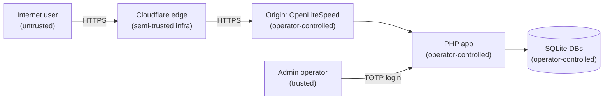

# Security Model

**Last updated:** 2026-05-13 (app v3.7.0)
**Audience:** Developer / future-agent reasoning about threats or reviewing security-sensitive changes.
**Companion to:** `design-document.md` §11 (controls inventory).
**Premise:** This document explains *what* we defend against and *why* — the controls in §11 explain *how*. Both must move together.

---

## Trust boundaries

Every arrow is a trust boundary. Input crossing right-to-left is sanitised; input crossing left-to-right is validated.

**Implication:** the boundary the app most defends is the User → PHP path. The operator → PHP path is trusted (operator has shell on the box already; defending against them is theatre).

---

## Threat model (what we defend against)

| # | Threat | Vector | Control | Residual risk |
|---|---|---|---|---|
| T1 | XSS — reflected | Calculator inputs echoed into result panels | `htmlspecialchars(..., ENT_QUOTES, 'UTF-8')` on every echo; CSP with per-request nonce blocks unnonced inline | Low. CSP defence-in-depth. |
| T2 | XSS — stored | Operator session note, API key label | Same as T1 + admin is single-operator, so attacker would need TOTP first | Negligible |
| T3 | CSRF | Form submissions to `request.php` | Honeypot field + optional Turnstile; SameSite=Lax cookies; admin actions require TOTP-verified session | Low (calculator forms are idempotent; admin is hard-gated) |
| T4 | SQL injection | User-supplied input reaching SQLite | All queries parameterised PDO; no user-controlled table/column names anywhere | Negligible |
| T5 | Command injection | Inputs reaching `shell_exec`/`system` | App never executes shell commands at runtime | Negligible |
| T6 | Path traversal | Input mapping to filesystem paths | App never opens files based on user input (templates/includes are static `require` paths) | Negligible |
| T7 | DoS — splitter explosion | `?ip=10.0.0.0/8&new_prefix=32` requests 16M subnets | `$split_max_subnets` cap (default 1024); enforced in `functions-split.php` | Low |
| T8 | DoS — VLSM list bomb | Submit a 100K-entry requirements list | Bounded by input parsing; PHP `memory_limit` is the last-resort cap | Medium. Consider explicit list-length cap in v3.8.0. |
| T9 | DoS — PMTU payload bomb | `payload_size=2^31`, `fragment_count=…` | Hard caps: `payload_size ≤ 65535`, `fragment_count ≤ 4096` (invariant I19, added v3.6.3 after smoke test caught 39.6 MB response) | Negligible |
| T10 | DoS — anonymous flood | Burst requests | Per-IP rate limit on anonymous; per-key limit on API users | Low. Cloudflare absorbs volumetric. |
| T11 | IDOR — session leak | Guess another user's shareable-session URL | 16-hex-char random IDs (96 bits — invariant I20, widened from 8 chars in v3.6.4); sessions are write-once read-many | Low |
| T12 | API key theft | Exfiltrate a Bearer token | Keys stored hashed (Argon2id); never logged; rotation via admin console; per-key audit log | Medium (no expiry-by-default; consider in v3.8.0 API DX work) |
| T13 | Admin compromise | Operator credential theft | TOTP required (no password-only); login rate-limited; audit log for every admin action | Low (relies on operator hygiene) |
| T14 | Iframe clickjacking | Embed app in malicious frame | `X-Frame-Options: SAMEORIGIN`; iframe consumers use same-origin embedding | Negligible |
| T15 | MITM | Network attacker intercepting traffic | HSTS with preload; Cloudflare TLS termination + origin TLS | Negligible (modern TLS) |
| T16 | Supply chain — vendor JS | Compromised SheetJS in `assets/vendor/xlsx/` | SRI-verified `<script>` tag; defer-loaded; SheetJS pinned to 0.20.3 | Low. Audit on every SheetJS bump. |
| T17 | Supply chain — composer deps | Compromised PHPUnit / PHPStan / etc. | Dev-only deps (`composer.json` `require-dev`); never run in production; lockfile committed | Negligible |
| T18 | Supply chain — PHP itself | Compromised PHP runtime | Operator-managed; outside app boundary | Accepted. Operator patches. |
| T19 | SSRF | Force the app to fetch attacker-chosen URLs | App's only outbound network call is Turnstile verify (fixed hostname) and DNS resolution for `resolve_ipv4_input` / `resolve_ipv6_input` (limited to PHP's `dns_get_record` against the operator's resolver) | Low |
| T20 | Information disclosure — error messages | Stack traces leaking paths/config | `display_errors=0` in production; PHP error log is operator-only | Negligible |
| T21 | Information disclosure — direct file access | Fetch `includes/config.php` or `data/*.sqlite` over HTTP | `.htaccess` blocks at every level (includes, templates, api/v1/helpers.php, data); separate test in Playwright suite | Negligible |

---

## What we explicitly do *not* defend against

These are out of scope, on purpose. Future work that changes the boundary should re-evaluate.

| # | Non-threat | Why |
|---|---|---|
| N1 | Operator with shell access | Operator owns the box. Defending here is theatre. |
| N2 | Malicious tarball install | The tarball IS the operator's chosen artifact. If untrusted, the operator already lost. |
| N3 | Subnet calculation results being "leaked" | Calculator output is deterministic from inputs. There's no secret to leak. |
| N4 | Persistent user identity | We have no user accounts. There's nothing to defend. |
| N5 | Audit log tamper-evidence | Operator owns the audit DB. Goal is operational forensics, not non-repudiation. Cryptographic logging is out of scope. |
| N6 | Side-channel timing on TOTP verification | Library handles constant-time comparison; we don't second-guess it. |
| N7 | DoS protection against a determined attacker | That's Cloudflare's job. App-layer caps are for accidents, not adversaries. |

---

## Authentication & authorisation

### Anonymous users
- Default surface. All calculator routes and most API endpoints.
- Rate-limited by source IP.
- No persistent state except the optional shareable session (write-once-read-many, 16-hex-char ID).

### API key users
- `Authorization: Bearer <key>` header.
- Keys are issued via the admin console (`/admin/keys.php`).
- Per-key rate limit (configurable, default higher than anonymous).
- Per-key audit log.
- **No expiry by default** — known gap, candidate for v3.8.0.

### Admin
- TOTP-required login. No password-only mode.
- Login rate-limited (5 failures → 15 min cooldown per IP).
- Cookie-based session in `data/admin-sessions.sqlite`; 24-hour idle timeout.
- Every admin action writes an `audit.action` row to `data/audit.sqlite`.

### Authorisation model
- **Two principals only:** anonymous and operator. No multi-tenant, no role hierarchy.
- API key inherits anonymous permissions but with a relaxed rate limit. Keys cannot perform admin actions.

---

## Cryptographic choices

| Use | Algorithm | Library |
|---|---|---|
| TOTP | RFC 6238 (HMAC-SHA1, 30s step) | Built-in (`hash_hmac`) per RFC implementation in `functions-admin-totp.php` |
| API key hashing | Argon2id | `password_hash(..., PASSWORD_ARGON2ID)` |
| Session ID generation | CSPRNG | `random_bytes(8)` → `bin2hex()` → 16-char hex |
| ULA prefix generation (user-facing tool) | SHA-1 per RFC 4193 | Built-in (`sha1`) — RFC mandates SHA-1 here; not a security boundary |
| SLAAC RFC 7217 stable interface IDs | F() = SHA-256 | `hash('sha256', ...)` |
| TLS | Operator + Cloudflare | Not app's concern |

No homegrown crypto. No custom XOR shenanigans. If you need a new primitive, propose adding a vetted library (libsodium is built into PHP 7.2+; use that before anything else).

---

## Input validation

All caller-controlled input is validated at the boundary (`request.php` for web, the handler file for API):
- Length-bounded.
- Pattern-matched where appropriate (`filter_var(FILTER_VALIDATE_IP, ...)`, regex for CIDR, etc.).
- Rejected with `InvalidArgumentException` (web → error banner; API → `json_err(400, ...)`).

Pure functions trust their inputs (per the methodology in `design-document.md` §4.5). This is deliberate — double-validation drift was a real bug source in earlier versions.

---

## Headers (set by `index.php`)

See `design-document.md` §11.1 for the inventory. The justification for each:

- **CSP with per-request nonce** — blocks the broadest class of XSS payloads even if a future `htmlspecialchars()` slip occurs. Nonce per request prevents replay.
- **HSTS with preload** — eliminates SSL-stripping; preload list ensures first-visit safety.
- **`X-Content-Type-Options: nosniff`** — prevents MIME confusion attacks on user-uploaded content (none here, but defence-in-depth).
- **`X-Frame-Options: SAMEORIGIN`** — clickjacking. (We allow same-origin iframe consumers; CSP `frame-ancestors` could replace this in a future cleanup.)
- **`Referrer-Policy: strict-origin-when-cross-origin`** — minimises shareable-URL leakage to third-party trackers.
- **`Permissions-Policy`** — deny-all for camera/mic/geolocation/payment/USB. We don't need any of them.

---

## Incident response

See `runbooks.md`. Specifically:
- R6 for API auth failures.
- R7 for rate-limit triage (don't disable; tune).
- R8 for SQLite session issues (sessions are non-critical; admin DB is critical).

If a vulnerability is reported: triage with `SECURITY.md` process. If actively exploited, ship a patch release within 24 hours; if not actively exploited, fold into the next scheduled minor.

---

## Audit & review cadence

| Activity | Cadence |
|---|---|
| Semgrep + OWASP rule scan | Every PR (CI gate) |
| Dependency review (composer audit, npm audit) | Monthly + on Dependabot PRs |
| Manual security review of new endpoints | At PR review time |
| Broader application security review | Once per major release theme |
| Threat-model refresh (this document) | Every major release or whenever the trust boundary changes |
| Cryptographic primitive review | Annually or when CVEs land |

---

## When this model is wrong

Update protocol:
1. New threat emerges → add a row to the threat table with control and residual risk.
2. New non-threat justified → add a row to the non-threats table with the reasoning.
3. Boundary moves (e.g., we add a queue worker → trust diagram changes) → update the Mermaid diagram first, then re-walk the threat table.
4. Cryptographic choice changes → update the table + cite the RFC/library/CVE that motivated the change.
5. Bump the "Last updated" header at the top.

If you're unsure whether something is a real threat, file it as one with a "Negligible" residual rating until proven otherwise. Better to over-document and trim than under-document and miss.
